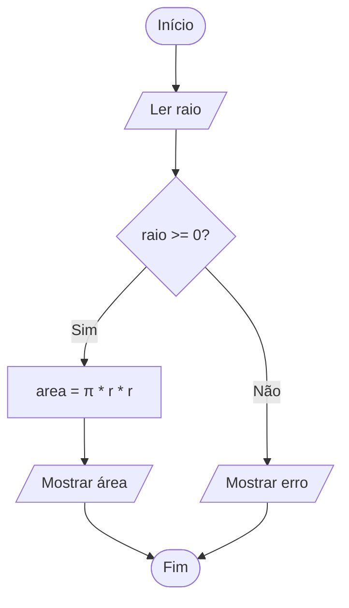

# Resumo: Algoritmos e Lógica de Programação

## 1\. Definição

> **Algoritmo** é uma sequência de passos bem definidos, ordenados e executáveis, que visa resolver um problema específico de forma finita.

Em termos simples: um algoritmo deve ser **claro**, **eficaz** e ter um **número limitado de etapas**, garantindo um início e um fim bem definidos. Quando projetado para computadores, chamamos de *algoritmo computacional*.

### Exemplos do Cotidiano

* Receita de lasanha.
* Instruções para montar um móvel.
* Método para trocar um pneu.

-----

## 2\. Características Principais

Para ser considerado um algoritmo válido, o procedimento deve respeitar os seguintes critérios:

1. **Definição Clara:** As etapas devem ser descritas de maneira clara e na ordem correta.
2. **Finitude:** O algoritmo deve sempre terminar após um número finito de passos (não pode entrar em *loop* infinito sem propósito).
3. **Efetividade:** Cada passo deve ser simples o suficiente para ser executado com precisão.
4. **Entradas (Inputs):** Pode ter zero ou mais dados fornecidos externamente.
5. **Saídas (Outputs):** Deve produzir pelo menos um resultado (valor, mensagem ou alteração de estado).

-----

## 3\. Formas de Representação

A representação varia conforme o nível de detalhe desejado:

* **Descrição Narrativa:** Linguagem natural. Fácil leitura para leigos, mas pode ser ambígua.
* **Fluxograma:** Representação gráfica com formas geométricas padronizadas. Ótimo para visualizar o fluxo de decisão.
* **Pseudocódigo (Portugol):** Linguagem estruturada próxima da programação real, mas sem a rigidez da sintaxe de uma linguagem específica (como Python ou C).

-----

## 4\. Exemplo Aplicado: "Calcular a Área do Círculo"

**Objetivo:** Calcular a área usando a fórmula $Area = \pi \cdot r^2$.

### A. Descrição Narrativa

1. Solicite ao usuário o valor do raio do círculo.
2. Verifique se o raio informado é maior ou igual a zero.
    * Caso contrário, exiba erro e encerre.
3. Calcule a área multiplicando $\pi$ pelo quadrado do raio.
4. Exiba o resultado.

### B. Fluxograma

Visualização do fluxo lógico descrito:



### C. Pseudocódigo

```text
Algoritmo "AreaCirculo"
Var
    r: Real
    area: Real
Início
    Escreva("Informe o raio: ")
    Leia(r)

    Se r < 0 então
        Escreva("Raio inválido. Operação cancelada.")
    Senão
        area <- 3.14159 * r * r
        Escreva("Área = ", area)
    FimSe
FimAlgoritmo
```

-----

## 5\. Boas Práticas

* **Nomes Significativos:** Use `area` e `raio` em vez de variáveis como `x` ou `y`.
* **Identação e Estrutura:** Separe visualmente Entrada, Processamento e Saída.
* **Validação (Sanitização):** Nunca confie cegamente na entrada do usuário (ex: verificar se o raio é negativo).
* **Simplicidade (KISS):** *Keep It Simple, Stupid*. Evite complexidade desnecessária.

-----

### Referências Rápidas

* **Fórmula:** $A = \pi r^2$
* **Arquivo de Exemplo:** `aula_01/area_circulo.py`

-----
