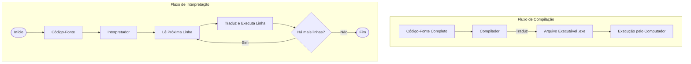

# Resumo: Tradutores de Código

(Montador, Compilador e Interpretador)

## 1\. Definição Geral

O computador não entende as linguagens de programação que nós escrevemos (como Python ou C), pois ele processa apenas **código de máquina** (sequências binárias de 0s e 1s).

Os **Tradutores** são softwares de sistema responsáveis por converter o **código-fonte** (escrito por humanos) para **código de máquina** (executável pelo processador).

## 2\. Os Três Tipos de Tradutores

### A. Montador (Assembler)

É o tradutor utilizado para linguagens de **baixo nível**, especificamente a linguagem **Assembly**.

* **Como funciona:** Ele traduz mnemônicos (comandos curtos como `MOV`, `ADD`, `JMP`) diretamente para instruções binárias.
* **Relação:** Geralmente, há uma correspondência de "1 para 1": uma linha de Assembly vira uma instrução de máquina.
* **Uso:** Programação de hardware, sistemas embarcados e drivers.

### B. Compilador

É utilizado para linguagens de **alto nível** (como C, C++, Rust).

* **Como funciona:** Ele traduz **todo** o código-fonte de uma só vez, gerando um novo arquivo independente (o executável ou código objeto) **antes** da execução.
* **Analogia:** É como traduzir um livro inteiro do inglês para o português e, só depois de pronto, entregar o livro traduzido para o leitor.
* **Vantagem:** O programa final é muito rápido, pois a tradução já foi feita.
* **Desvantagem:** Se houver um erro, é preciso corrigir e recompilar tudo novamente.

### C. Interpretador

Também utilizado para linguagens de **alto nível** (como Python, JavaScript, PHP).

* **Como funciona:** Ele traduz e executa o código **linha por linha** (ou instrução por instrução) em tempo real. Não gera um arquivo executável para uso posterior.
* **Analogia:** É como um intérprete simultâneo em uma palestra, que traduz frase por frase enquanto o palestrante fala.
* **Vantagem:** Facilita o desenvolvimento e a identificação de erros (feedback imediato).
* **Desvantagem:** A execução tende a ser mais lenta que a de um programa compilado, pois a tradução ocorre durante o uso.

-----

## 3\. Fluxograma Comparativo

Este diagrama ilustra a diferença no fluxo de trabalho entre Compiladores e Interpretadores:

-----

## 4\. Quadro Resumo: Diferenças Chaves

| Característica | Compilador | Interpretador | Montador |
| :--- | :--- | :--- | :--- |
| **Entrada** | Código Completo (Alto Nível) | Linha/Instrução (Alto Nível) | Código Assembly (Baixo Nível) |
| **Saída** | Arquivo Executável Independente | Execução do comando | Código de Máquina |
| **Execução** | Muito Rápida | Mais Lenta | Muito Rápida |
| **Detecção de Erros** | No final da compilação | Imediata (para na linha do erro) | Na montagem |
| **Exemplos** | C, C++, Go, Pascal | Python, Ruby, JavaScript | Assembly (NASM, MASM) |

-----

## 5\. Nota sobre Linguagens Híbridas (O "Meio-Termo")

Algumas linguagens modernas, como **Java** e **C\#**, utilizam uma abordagem mista para unir o melhor dos dois mundos.

1. O código é **compilado** para uma linguagem intermediária (chamada *Bytecode*).
2. Esse Bytecode é **interpretado** (ou compilado em tempo real - JIT) por uma Máquina Virtual (como a JVM) instalada no computador do usuário.
3. Isso garante portabilidade (roda em qualquer sistema) com boa velocidade.

-----
